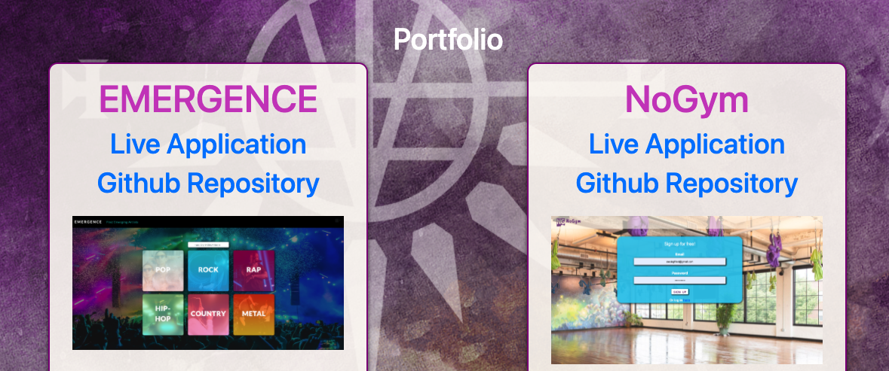

# **HW20-react-portfolio**


## **Table of Contents**

* [Description](#Description)
* [Installation](#Installation)
* [Screenshots](#Screenshots)
* [Contributing](#Contributing)
* [Tests](#Tests)
* [License](#License)
* [Questions](#Questions)

## **Description**


The purpose of this assignment was to create a new portfolio using React.  This proved to be a much bigger undertaking than I initally gave it credit for.  Specifically the interactions between componenets and then styling in React is very different from standard JS.  For instance, relative file paths no longer work as intended because their functionality is based on where your file is, but if you're using components, that attribute can change, thus not rendering your picture. 

Live app: https://react-portfolio-aws.herokuapp.com/


## **Installation**
1. Clone the repo
```sh
https://github.com/AWSiegfried/HW20-react-portfolio.git
```

2. Install NPM packages
```sh
npm install
```

## **Screenshot**




## **Contributing**

Please feel free to contribute to this repo! Emails are appreciated (email address below) but even then, hopefully it just helps you out!


## **Tests**

Test your library
```sh
npm test
```

## **License**

This repository is covered under the MIT license. 

## **Questions**
Please contact with any questions or thoughts.
Email: awsiegfried@gmail.com

Check out [my GitHub](https://github.com/AWSiegfried)
